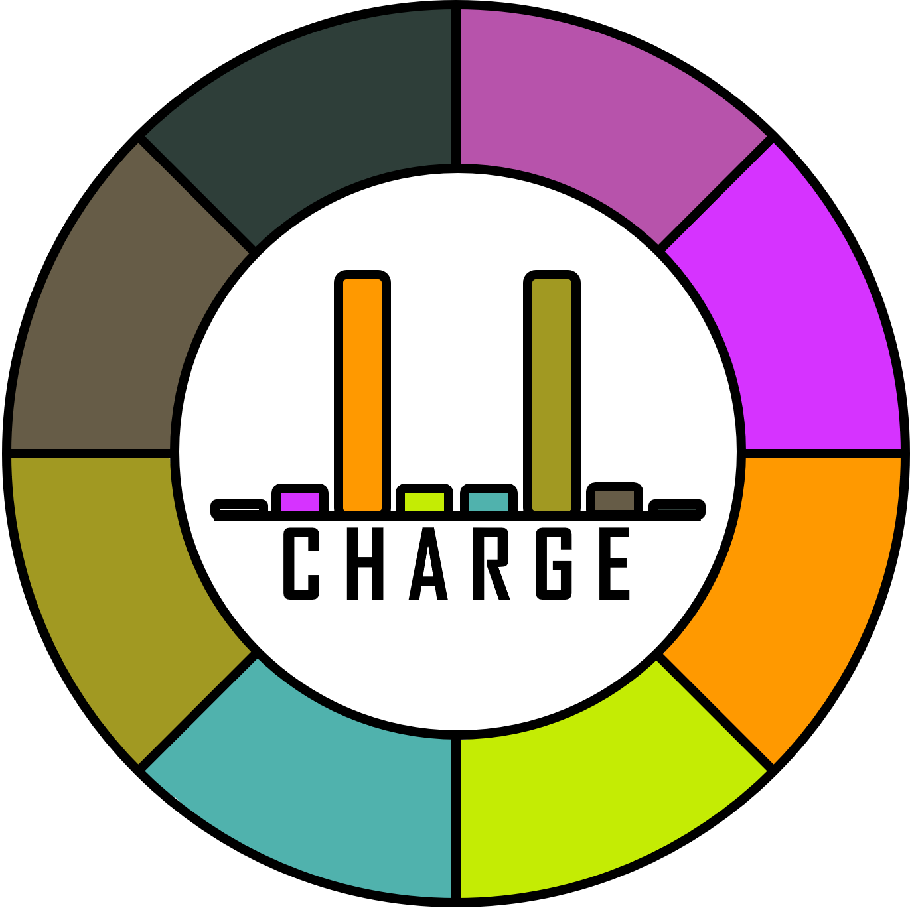

# CHARGE
Cell HierARchy Gene Explorer (CHARGE) is an interactive tool for identifying genes of potential biological interest in a cell type taxonomy. 



CHARGE uses fast, cluster-centric approaches to find global or local marker genes, differentially expressed genes, and genes following user selected gradients. Outputs of CHARGE include basic visualization of interesting genes and download of gene names and analysis statistics. CHARGE emphasizes speed and usability over statistical rigor, and we encourage users to explore cell level data in the Allen Brain Cell Atlas, CELLxGENE, or related tools.

## Generated CHARGE'd data files

CHARGE can be run on any taxonomy saved in the [Allen Institute Taxonomy (AIT) schema and h5ad file format](https://github.com/AllenInstitute/AllenInstituteTaxonomy), as well as from clustered and annotated cell x gene expression data. The [CHARGE_taxonomy](https://github.com/AllenInstitute/CHARGE_taxonomy) companion page includes code for generating .RData files readable by CHARGE.  

## Running CHARGE 

### Option 1: Visit the website (recommended)

We recommend using the version of this tool [hosted on molgen-shiny.org](https://molgen-shiny.org/CHARGE/)**. This includes [all available public taxonomies](https://github.com/AllenInstitute/AllenInstituteTaxonomy/blob/main/taxonomies.md) as of 15 August 2025.  While most user-provided files should be uploadable, files from larger taxonomies may need to be saved to a public S3 bucket to be accessible via the website version of the app.  Files of any size can be accessed via a local app instance.

### Option 2: Run locally

For power users, this tool can also be run locally in R Studio by following the steps below.

#### Setup and launch RStudio
(You only need do this step once).
1. Install R (ideally version 4.5.1)
2. Install RStudio
3. Download the files from this repo in a working directory
4. Set up your R environment to align with the [renv.lock file](https://github.com/AllenInstitute/CHARGE/blob/main/renv.lock)

We recommend using [rig](https://github.com/r-lib/rig) for R installation management along with [renv](https://rstudio.github.io/renv/) for R environment management.  After installing rig, you should be able to run these rig commands in a terminal from your working directory to tackle steps #1 and #4:
```
rig add 4.5.1
rig add rtools45
rig rstudio renv.lock
```
This should set up and then launch RStudio with the correct package configurations. (The first two lines of code only need to be run once).

#### Run the app
1. In RStudio, open the file `ui.R` and click the "Run App" button in the upper right corner of the screen
2. Explore!

The only difference between local and web versions is that the local version can point to locations on your local computer.  Since CHARGE'd data set files can be quite large, this may be necessary for files not located in a public S3 bucket.

## Reporting issues or suggestions

Please share any comments, suggestions, bugs, or any other thoughts using the button in the app, or by [submitting an issue](https://github.com/AllenInstitute/CHARGE/issues).

## License

The license for this package is available on Github at: https://github.com/AllenInstitute/CHARGE/blob/master/LICENSE

## Level of Support

We are actively updating this tool. **Community involvement is encouraged through both issues and pull requests.**
